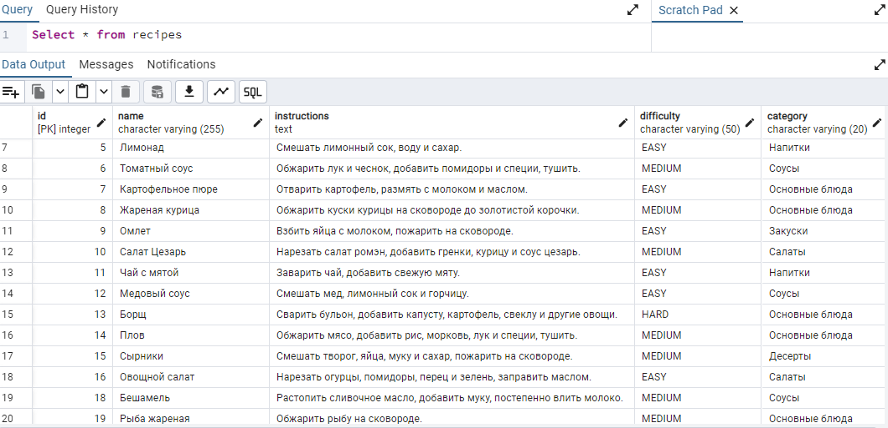

# Recipe
#  Recipe Management system

## Description

This project is a recipe management website. It allows users to create, view, edit, delete, and search for recipes by name. The app also supports recipe categorization and difficulty level setting.

## Project Requirements
1. **InsertUser**: Add User to Database with information such as login, password.
2. **Insert**: Add new Recipe to Database with information such as name, instructions, difficulty, category, ingredients.
3. **findByName****: Displays the recipe when you enter the name of recipe
4. **findByCategory****: Displays all recipes in which the entered category is specified
5. **DeleteByName**: Delete all information about Recip by name
6. **Update**: Updating recipe information
   
## Team Members
Abdurazakova Tahira

## Roles of Group Members

Abdurazakova Tahira: All functions

## ScreenShots

## UML Diagram

